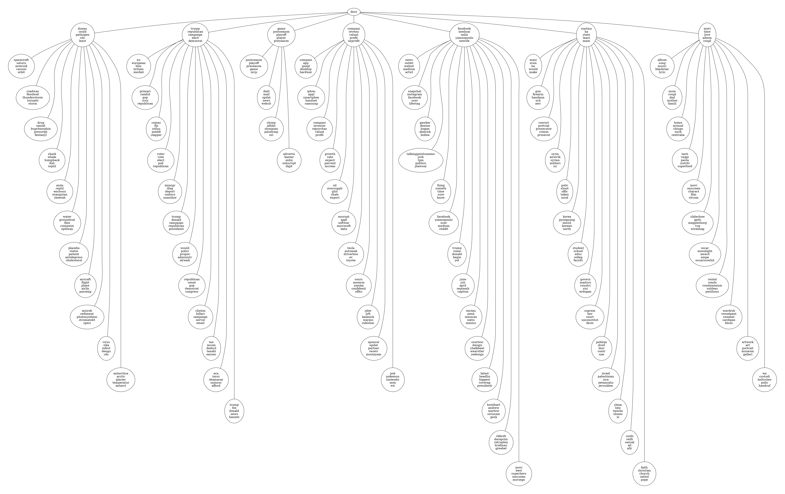

# ProfitTM
A hierarchical topic modeling framework based on word embeddings, neural nets and optimal number of topics detection. 

# Example of 2 level hierarchy ("All the news" dataset from Kaggle)

