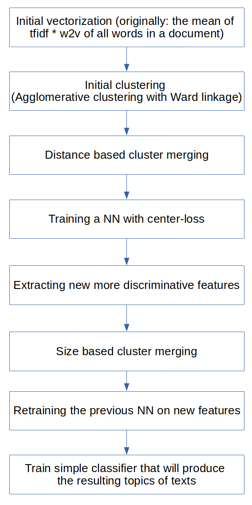

# ProfitTM
A hierarchical topic modeling framework based on word embeddings and neural nets that self finds optimal number of topics on each level.

# Example of 2 level hierarchy ("All the news" dataset from Kaggle)

# The node pipeline scheme

